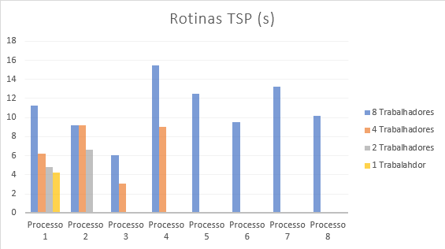

# Busca em árvore paralelizada para o problema TSP
Descrição dos testes realizados, problemas identificados e não resolvidos.

*por **Fernando Lima** (**2020877**)*

Esse relatório descreve a motivação, implementação e resultados da problema do caixeiro viajante (TSP) resolvido por busca em árvore de uma forma paralelizada.
O TSP é um problema NP-Completo, sendo assim necessária a comparação de todas as soluções possíveis para achar a rota de menor custo (a melhor nesse sentido). Há maneiras de se implementar de uma forma efeciente no quesito de construir e testar as possibilidades de rotas, extraindo a melhor. Serão apresentadas formas paralelizada explorando Threads e Processos, utilizando as implementações **estáticas** da busca em árvore utilizando **Pthreads** e **MPICH**.  

Após as implementações, cada programa foi testado utilizando 1, 2, 4 e 8 threads/processos dedidaco(s) ao trabalho de calcular cada custo de árvore em sub-rotas. Todo o trablaho pode ser encontrado no [repositório do github](https://github.com/fol21/tsp-dsitributed-tree-search).
## Metodologia 

Ambas implementações começam de forma similar, cada uma possui um procosse de Entrada para o arquivo que contém a base de dados das cidades e custos de cada rota entre essas. Após a criação da matriz de rotas, o processo divide a busca em sub-árvores usando o alogritmo de *Breadeth First Search* (BFS) para formar possíveis rotas e garantir que cada trabalhador(thread ou processo) receba pelo menos uma rota para formar uma sub-árvore, armazenando as rotas e o custo total dessas em uma pilha.

````C
#include <mpi.h>
#include <stdio.h>
#include <stdlib.h>
#include <pthread.h>
#include <unistd.h>
#include <limits.h>
#include <string.h>

#include<tour.h>
#include<tour-mpi.h>
#include<tour-queue.h>
#include<tour-stack.h>
#include <benchmark.h>

...

void init();
void bfs(tour_queue_t queue, int size); // Breadth first search, used to expand enough nodes to allocate threads
void* tsp(void* stack, int process_count, int rank);
````
<p style="text-align: center; font-size": 8px> As três etapas do Processo: I/O, BSF e TSP em cada trabalhador</p>

Enfím, cada trabalhador inicia o processo do TSP manipulando sua pilha privada, e após todas as possibilidades da sub-árvore se esgotarem a de menor custo é notificada pelo trabalhador, a menor possível entre os trabalhadores é a melhor rota.


O processo de inicialização é descrito abaixo, a rotina se resume a ler um arquivo contendo o custo de cidade para cidade e formar a matriz.

````C
void init(FILE* stream)
{
    char line[1024];
    fgets(line, 1024, stream);
    char* tmp = strdup(line);

    n = atoi(getfield(tmp, 1));
    printf("Number of cities %d\n", n);


    for (int i = 0; i < n; ++i) {
        for (int j = 0; j < n; ++j) {
            digraph[i][j] = i == j ? 0 : INT_MAX;
        }
    }

    int _row = 0;
    char* _tmp;
    while (fgets(line, 1024, stream))
    {
        for(int _col = 0; _col < n; _col++)
        {
            _tmp = strdup(line);
            digraph[_row][_col] = atoi(getfield(_tmp, _col + 1));
            // printf("Field %d would be %d\n ", _col + 1, digraph[_row][_col] );
        }
        // NOTE strtok clobbers tmp
        _row++;
    }
    free(_tmp);

    best_tour = malloc(sizeof(struct tour_t));
    best_tour->cost = INT_MAX;
}
````

### Pthreads

O programa implementando para a utilização de threads pode ser sintetizado nas etapas de I/O, BSF e criação de threads distribuindo uma fila de *Tours*, estrutura de dados que contém a informação e custo total de uma rota, a fila é gerada pelo BSF e seus itens distribuídos como argumentos da rotina do trabalhador, no caso o TSP implementado com threads.

````C
...
int main(int argc, char const *argv[])
{
    CPU_NUM = atoi(argv[1]);
    FILE* stream = fopen(argv[2], "r");
    init(stream);

    double time = stopwatch(main_routine, NULL);
    printf("====== Performance =======\n");
    printf("Total calculation time: %.2f seconds\n", time);
    return 0;
}
````

O TSP implementado com threads utiliza locks para bloquear as variáveis compartilhadas entre as threads na escrita do *best_tour* a melhor rota encontrada por aquele trabalhador naquela sub-árvore.

````C
void* tsp(void* stack)
{
    tour_stack_t my_stack = (tour_stack_t)stack;
    tour_t cur_tour;

    printf("[%s %d %ld] my_stack.size = %d\n", __FILE__, __LINE__, pthread_self(), stack_size(stack));

    while (!stack_empty(my_stack)) {
        cur_tour = pop(my_stack);

        if (cur_tour->len == n) {
            // Determine whether it can be updated
            int city = get_last_city(cur_tour);

            if (digraph[city][homecity] != INT_MAX
                && cur_tour->cost + digraph[city][homecity] < best_tour->cost) {

                // Lock
                pthread_mutex_lock(&best_tour_mutex);

                // In the process of waiting for the lock, other threads may have modified the optimal path, so it needs to be determined again
                if (cur_tour->cost + digraph[city][homecity] < best_tour->cost) {
                    // Optimal cost of renewal
                    best_tour->cost = cur_tour->cost + digraph[city][homecity];
                    // Update the optimal path
                    copy_tour(best_tour, cur_tour);
                    append_city(best_tour, homecity, digraph[get_last_city(best_tour)][homecity]);
                }

                // Release the lock
                pthread_mutex_unlock(&best_tour_mutex);
            }

            continue;
        }

        for (int nbr = n - 1; nbr >= 1; --nbr) {
            // Skip cur_ Existing nodes in the tour
            if (find_in_tour(cur_tour, nbr) != -1) {
                continue;
            }

            int new_cost = cur_tour->cost + digraph[get_last_city(cur_tour)][nbr];

            // Branch boundary, skip the node that can not expand to a better solution
            if (new_cost >= best_tour->cost) {
                continue;
            }

            append_city(cur_tour, nbr, digraph[get_last_city(cur_tour)][nbr]);
            push_copy(my_stack, cur_tour);
            remove_last_city(cur_tour, digraph[cur_tour->tour[cur_tour->len - 2]][cur_tour->tour[cur_tour->len - 1]]);
        }

        free(cur_tour);
    }

    return best_tour;
}
````

### MPI

O Programa utilizando MPI se inicia da mesma forma com PThreads, I/O para gerar a matriz e BSF para gerar as filas. A implementação utilizada com MPICH paraleliza criando 1, 2, 4 ou 8 processos trabalhadores mais um administrador do mesmo código compilado.

````C
...
int main(int argc, char const *argv[])
{ 
    {
        char hostname[256];
        gethostname(hostname, sizeof(hostname));
        printf("PID %d on %s ready for attach\n", getpid(), hostname)
    }
  // Initialize the MPI environment
  MPI_Init(NULL, NULL);
  // Find out rank, size
  int world_rank;
  MPI_Comm_rank(MPI_COMM_WORLD, &world_rank);
  int world_size;
  MPI_Comm_size(MPI_COMM_WORLD, &world_size);

  // We are assuming at least 2 processes for this task
  if (world_size < 2) {
    fprintf(stderr, "World size must be greater than 1 for %s\n", argv[0]);
    MPI_Abort(MPI_COMM_WORLD, 1);
  }

  FILE* stream = fopen(argv[1], "r");
  init(stream);

  if (world_rank == 0) {
    double time = stopwatch(main_routine, &world_size);
    printf("====== Performance =======\n");
    printf("Total calculation time: %.2f seconds\n", time);
  } else {
    int size_n_rank[2] = {world_size, world_rank};
    double time = stopwatch(process_routine, size_n_rank);
    printf("====== Performance =======\n");
    printf("Process %d calculation time: %.2f seconds\n", world_rank, time);
  }
  MPI_Finalize();
}
````

Em tempo de execução o *rank*, identificador do MPI para os processos guia o processo para executar a rotina do administrador ou dos trabalhadores. O Administrador (rank 0) inicia o processo de BSF e envia para os trabalhadores pelo menos um item para formar as sub-árvores. Cada trabalhador espera o recebimento do item (o *tour*), insere na sua pilha particular e inicia a processo TSP, que neste caso, como pode ser visto na rotina abaixo, é similar a implementação com threads, porem a melhor rota (*best_tour*) é notificada para todos os trabalhadores a fim de "podar" e cortar cálculos descessários em outros trablhadores.

````C
void* tsp(void* stack, int process_count, int rank)
{
    tour_stack_t my_stack = (tour_stack_t)stack;
    tour_t cur_tour;

    printf("[%s %d %ld] my_stack.size = %d\n", __FILE__, __LINE__, pthread_self(), stack_size(stack));

    while (!stack_empty(my_stack)) {
        cur_tour = pop(my_stack);

        if (cur_tour->len == n) {
            // Determine whether it can be updated
            int city = get_last_city(cur_tour);

            if (digraph[city][homecity] != INT_MAX
                && cur_tour->cost + digraph[city][homecity] < best_tour->cost) {

                // In the process of waiting for the lock, other processes 
                // may have modified the optimal path, so it needs to be determined again
                for (int i = 0; i < process_count; i++)
                {
                    int flag;
                    tour_t _t = receive_tour_package(i + 1, &flag);
                    best_tour = (flag && _t->cost < best_tour->cost) ? _t : best_tour;
                }
                if (cur_tour->cost + digraph[city][homecity] < best_tour->cost) {
                    // Optimal cost of renewal
                    best_tour->cost = cur_tour->cost + digraph[city][homecity];
                    // Update the optimal path
                    copy_tour(best_tour, cur_tour);
                    append_city(best_tour, homecity, digraph[get_last_city(best_tour)][homecity]);
                    
                    for (int i = 0; i < process_count; i++)
                    {
                        if(i + 1 != rank)
                            send_tour_package(create_tour_package(best_tour, i + 1));
                    }
                }
            }
            continue;
        }

        for (int nbr = n - 1; nbr >= 1; --nbr) {
            // Skip cur_ Existing nodes in the tour
            if (find_in_tour(cur_tour, nbr) != -1) {
                continue;
            }
            int new_cost = cur_tour->cost + digraph[get_last_city(cur_tour)][nbr];
            // Branch boundary, skip the node that can not expand to a better solution
            if (new_cost >= best_tour->cost) {
                continue;
            }
            append_city(cur_tour, nbr, digraph[get_last_city(cur_tour)][nbr]);
            push_copy(my_stack, cur_tour);
            remove_last_city(cur_tour, digraph[cur_tour->tour[cur_tour->len - 2]][cur_tour->tour[cur_tour->len - 1]]);
        }
        free(cur_tour);
    }
    return NULL;
}
````

Ao final do TSP em cada trabalhador, esses notificam enviando ao administrador o melhor tour ao final e este espera o envio de todos os trabalhadores, formando uma barreira, para selecionar o melhor geral.

## Resultados

Os resultados de cada implementação utilizando 1, 2, 4 e 8 trabalhadores é descrito na tabela com o tempo em segundos:

<table style="border-collapse:collapse;border-spacing:0" class="tg">
    <thead>
        <tr>
            <th
                style="background-color:#c0c0c0;border-color:inherit;border-style:solid;border-width:1px;font-family:Arial, sans-serif;font-size:14px;font-weight:normal;overflow:hidden;padding:10px 5px;text-align:left;vertical-align:top;word-break:normal">
                Dataset</th>
            <th style="background-color:#c0c0c0;border-color:inherit;border-style:solid;border-width:1px;font-family:Arial, sans-serif;font-size:14px;font-weight:normal;overflow:hidden;padding:10px 5px;text-align:left;vertical-align:top;word-break:normal"
                colspan="2">UK12 (12 cidades)</th>
            <th style="background-color:#c0c0c0;border-color:inherit;border-style:solid;border-width:1px;font-family:Arial, sans-serif;font-size:14px;font-weight:normal;overflow:hidden;padding:10px 5px;text-align:left;vertical-align:top;word-break:normal"
                colspan="2">P01 (15 cidades)</th>
        </tr>
    </thead>
    <tbody>
        <tr>
            <td
                style="background-color:#efefef;border-color:inherit;border-style:solid;border-width:1px;font-family:Arial, sans-serif;font-size:14px;overflow:hidden;padding:10px 5px;text-align:center;vertical-align:top;word-break:normal">
                Th/Pr (s)</td>
            <td
                style="background-color:#efefef;border-color:inherit;border-style:solid;border-width:1px;font-family:Arial, sans-serif;font-size:14px;overflow:hidden;padding:10px 5px;text-align:center;vertical-align:top;word-break:normal">
                Pth</td>
            <td
                style="background-color:#efefef;border-color:inherit;border-style:solid;border-width:1px;font-family:Arial, sans-serif;font-size:14px;overflow:hidden;padding:10px 5px;text-align:center;vertical-align:top;word-break:normal">
                MPI</td>
            <td
                style="background-color:#efefef;border-color:inherit;border-style:solid;border-width:1px;font-family:Arial, sans-serif;font-size:14px;overflow:hidden;padding:10px 5px;text-align:center;vertical-align:top;word-break:normal">
                Pth</td>
            <td
                style="background-color:#efefef;border-color:inherit;border-style:solid;border-width:1px;font-family:Arial, sans-serif;font-size:14px;overflow:hidden;padding:10px 5px;text-align:center;vertical-align:top;word-break:normal">
                MPI</td>
        </tr>
        <tr>
            <td
                style="background-color:#efefef;border-color:inherit;border-style:solid;border-width:1px;font-family:Arial, sans-serif;font-size:14px;overflow:hidden;padding:10px 5px;text-align:center;vertical-align:top;word-break:normal">
                1</td>
            <td
                style="border-color:inherit;border-style:solid;border-width:1px;font-family:Arial, sans-serif;font-size:14px;overflow:hidden;padding:10px 5px;text-align:center;vertical-align:top;word-break:normal">
                0.04</td>
            <td
                style="border-color:inherit;border-style:solid;border-width:1px;font-family:Arial, sans-serif;font-size:14px;overflow:hidden;padding:10px 5px;text-align:center;vertical-align:top;word-break:normal">
                0.09</td>
            <td
                style="border-color:inherit;border-style:solid;border-width:1px;font-family:Arial, sans-serif;font-size:14px;overflow:hidden;padding:10px 5px;text-align:center;vertical-align:top;word-break:normal">
                3.65</td>
            <td
                style="border-color:inherit;border-style:solid;border-width:1px;font-family:Arial, sans-serif;font-size:14px;overflow:hidden;padding:10px 5px;text-align:center;vertical-align:top;word-break:normal">
                4.19</td>
        </tr>
        <tr>
            <td
                style="background-color:#efefef;border-color:inherit;border-style:solid;border-width:1px;font-family:Arial, sans-serif;font-size:14px;overflow:hidden;padding:10px 5px;text-align:center;vertical-align:top;word-break:normal">
                2</td>
            <td
                style="border-color:inherit;border-style:solid;border-width:1px;font-family:Arial, sans-serif;font-size:14px;overflow:hidden;padding:10px 5px;text-align:center;vertical-align:top;word-break:normal">
                0.02</td>
            <td
                style="border-color:inherit;border-style:solid;border-width:1px;font-family:Arial, sans-serif;font-size:14px;overflow:hidden;padding:10px 5px;text-align:center;vertical-align:top;word-break:normal">
                0.04</td>
            <td
                style="border-color:inherit;border-style:solid;border-width:1px;font-family:Arial, sans-serif;font-size:14px;overflow:hidden;padding:10px 5px;text-align:center;vertical-align:top;word-break:normal">
                4.01</td>
            <td
                style="border-color:inherit;border-style:solid;border-width:1px;font-family:Arial, sans-serif;font-size:14px;overflow:hidden;padding:10px 5px;text-align:center;vertical-align:top;word-break:normal">
                6.66</td>
        </tr>
        <tr>
            <td
                style="background-color:#efefef;border-color:inherit;border-style:solid;border-width:1px;font-family:Arial, sans-serif;font-size:14px;overflow:hidden;padding:10px 5px;text-align:center;vertical-align:top;word-break:normal">
                4</td>
            <td
                style="border-color:inherit;border-style:solid;border-width:1px;font-family:Arial, sans-serif;font-size:14px;overflow:hidden;padding:10px 5px;text-align:center;vertical-align:top;word-break:normal">
                0.06</td>
            <td
                style="border-color:inherit;border-style:solid;border-width:1px;font-family:Arial, sans-serif;font-size:14px;overflow:hidden;padding:10px 5px;text-align:center;vertical-align:top;word-break:normal">
                0.12</td>
            <td
                style="border-color:inherit;border-style:solid;border-width:1px;font-family:Arial, sans-serif;font-size:14px;overflow:hidden;padding:10px 5px;text-align:center;vertical-align:top;word-break:normal">
                2.52</td>
            <td
                style="border-color:inherit;border-style:solid;border-width:1px;font-family:Arial, sans-serif;font-size:14px;overflow:hidden;padding:10px 5px;text-align:center;vertical-align:top;word-break:normal">
                9.15</td>
        </tr>
        <tr>
            <td
                style="background-color:#efefef;border-color:inherit;border-style:solid;border-width:1px;font-family:Arial, sans-serif;font-size:14px;overflow:hidden;padding:10px 5px;text-align:center;vertical-align:top;word-break:normal">
                8</td>
            <td
                style="border-color:inherit;border-style:solid;border-width:1px;font-family:Arial, sans-serif;font-size:14px;overflow:hidden;padding:10px 5px;text-align:center;vertical-align:top;word-break:normal">
                0.07</td>
            <td
                style="border-color:inherit;border-style:solid;border-width:1px;font-family:Arial, sans-serif;font-size:14px;overflow:hidden;padding:10px 5px;text-align:center;vertical-align:top;word-break:normal">
                0.13</td>
            <td
                style="border-color:inherit;border-style:solid;border-width:1px;font-family:Arial, sans-serif;font-size:14px;overflow:hidden;padding:10px 5px;text-align:center;vertical-align:top;word-break:normal">
                3.08</td>
            <td
                style="border-color:inherit;border-style:solid;border-width:1px;font-family:Arial, sans-serif;font-size:14px;overflow:hidden;padding:10px 5px;text-align:center;vertical-align:top;word-break:normal">
                16.32</td>
        </tr>
    </tbody>
</table>


Como foi utilizada a implementação estática, é interessante observar o tempo levado por cada trabalhador para calcular toda a rotina em sua sub-árvore.

<p style="text-align: center; font-size": 8px>
    
</p>
<p style="text-align: center; font-size": 8px> Segundos necessários para cada trabalhador em configurações com 1,2,4 e 8 calcular a rotina TSP.</p>


O gráfico acima descreve quanto tempo, em segundos, foi necessários para cada trabalhador nas configurações com 1, 2, 4 e 8 processos calcular a rotina TSP na implementação com MPICH. Foi escolhida a base de dados P01 com 15 cidades.

Nota-se o gargalo da implementação estática, os processos estão desbalanceados em questão do tamanho de cada sub-árvore, isso pode ser observado pela forma heterogênia de quanto tempo cada processo leva para terminar a rotina TSP e suma pilha particular.